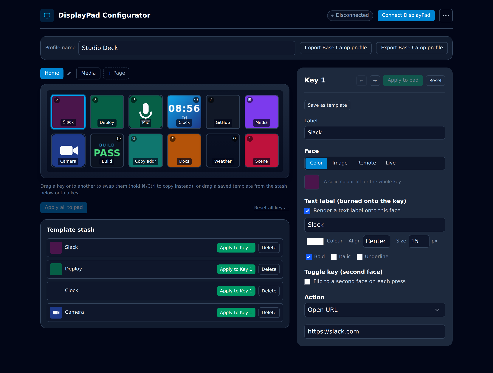
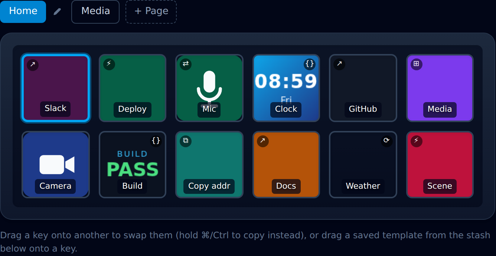
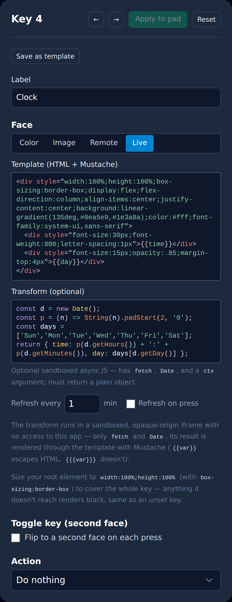
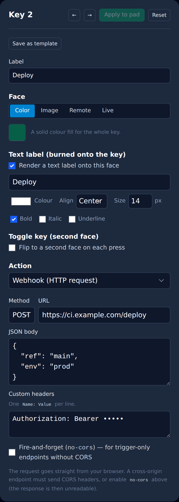

<div align="center">

# DisplayPad Configurator

**Set up your Mountain DisplayPad straight from the browser — no install, no driver, no backend.**

A client-only [PWA](https://web.dev/explore/progressive-web-apps) that talks to the hardware over [WebHID](https://developer.mozilla.org/en-US/docs/Web/API/WebHID_API): paint each of the 12 keys, choose what it does when pressed, and push it to the pad live.

[**▶ Open the app**](https://justb81.github.io/mountain-displaypad-pwa/) · [Features](#features) · [Key faces](#key-faces) · [Actions](#actions) · [Secrets](#secrets) · [Base Camp import/export](#base-camp-importexport) · [Getting started](#getting-started)

[](https://github.com/justb81/mountain-displaypad-pwa/actions/workflows/ci.yml)
&nbsp;·&nbsp; SvelteKit · Svelte 5 · Tailwind 4 · WebHID · installable & offline

<br />



</div>

---

## What is a DisplayPad?

The **Mountain DisplayPad** is a 6×2 macro pad — 12 keys, each with its own **102×102-pixel LCD** under the keycap. Instead of static legends, every key shows an image you choose, and the app reacts the moment you press one.

This configurator does all of that from a browser tab. There is **no companion app and no OS-level agent**: the page opens the device with WebHID, encodes the pixels itself, streams them to each key, and listens for presses in real time.

## Features

<div align="center">

</div>

- 🖥️ **Live virtual keypad** — a pixel-accurate mirror of the physical pad that updates as you edit, whether or not hardware is connected.
- 🎨 **Four kinds of key face** — a solid **colour**, an uploaded **image**, a **remote** image URL, or a data-driven **live template** (see [Key faces](#key-faces)).
- 🔤 **Burned-on text labels** — add a caption to any colour/image/remote face with per-key colour, alignment, size, and bold/italic/underline.
- ⚡ **Rich press actions** — open a URL in the browser, fire an HTTP **webhook**, or jump between pages (see [Actions](#actions)).
- 🔑 **Secrets** — store an API token once and reference it by name (`{{secret.KEY}}` in webhook headers/body, `ctx.secrets.KEY` in a transform) so credentials stay out of your saved and exported configs (see [Secrets](#secrets)).
- 🔁 **Toggle keys** — give a key a second face and it flips between the two on every press (mic mute/unmute, scene A/B, …).
- 🗂️ **Pages** — organise keys across multiple pages; a _Page navigation_ key jumps to another page, returns to the previous one, or steps to the next page in sequence, mirroring Base Camp's nested pages. Rename pages and navigate them from the breadcrumb tabs.
- 🖱️ **Drag & drop + template stash** — drag one key onto another to swap (hold ⌘/Ctrl to copy), or drag a key into the **template stash** to bank its full setup and clear the slot (hold ⌘/Ctrl to keep a copy). Tag stashed templates with keywords to filter and auto-cluster them, show their face/action icons at a glance, and export/import the whole stash as a JSON file (drop one onto the panel to import).
- 📄 **Base Camp import/export** — read and write Mountain Base Camp `<Profile>` XML, so configs move both ways with the official software (see [Base Camp import/export](#base-camp-importexport)).
- ✂️ **Remove background** — one click knocks the flat background colour out of an uploaded icon.
- 💾 **Remembers everything** — your keymap, pages, and stash persist in the browser, and a previously-approved pad reconnects silently on the next visit.
- 📲 **Installable & offline** — a proper PWA with a service worker; install it and it launches and runs without a network.
- 🔒 **Private by design** — client-only, no backend, no telemetry. Nothing you configure ever leaves your machine unless _you_ point a key at a URL.

## Key faces

Each key's picture — its **face** — is one of four types, switched from the _Face_ control in the inspector.

| Face       | What it is                                                                                                                        |
| ---------- | --------------------------------------------------------------------------------------------------------------------------------- |
| **Color**  | A solid fill, optionally with a burned-on text label.                                                                             |
| **Image**  | Any square image you upload, scaled to 102×102. Includes a one-click _remove background_.                                         |
| **Remote** | An image fetched from a URL and refreshed on a timer or on press — a live status icon, a camera thumbnail, a weather glyph.       |
| **Live**   | A **template**: HTML rendered through [Mustache](https://mustache.github.io/), fed by an optional sandboxed JavaScript transform. |

### Live templates

A **live** face turns a key into a tiny, self-updating widget. You write a snippet of HTML (with Mustache placeholders), and an optional `transform` — sandboxed async JavaScript with access to `fetch` and `Date` — supplies the values. The result is rasterised to the key and can refresh on a timer or whenever the key is pressed.

<div align="center">

</div>

The clock tile above is just this:

```html
<div
	style="width:100%;height:100%;display:flex;flex-direction:column;
            align-items:center;justify-content:center;
            background:linear-gradient(135deg,#0ea5e9,#1e3a8a);color:#fff"
>
	<div style="font-size:30px;font-weight:800">{{time}}</div>
	<div style="font-size:15px;opacity:.85">{{day}}</div>
</div>
```

```js
// transform — runs in an opaque-origin sandbox iframe; must return a plain object
const d = new Date();
const p = (n) => String(n).padStart(2, '0');
const days = ['Sun', 'Mon', 'Tue', 'Wed', 'Thu', 'Fri', 'Sat'];
return { time: `${p(d.getHours())}:${p(d.getMinutes())}`, day: days[d.getDay()] };
```

The transform runs in an **opaque-origin `sandbox="allow-scripts"` iframe** with no access to the app, `localStorage`, or your cookies — only `fetch`, `Date`, and a `ctx` argument. Stored [secrets](#secrets) arrive on `ctx.secrets` (e.g. `ctx.secrets.API_TOKEN`), so a transform can authenticate a `fetch` without the token living in the template. A transform imported from someone else's profile never runs until you explicitly approve it.

## Actions

Assign what a key does when it's pressed. Because everything happens in the page, actions are the ones a browser can safely perform:

| Action                  | Effect                                                                                                                                                                                       |
| ----------------------- | -------------------------------------------------------------------------------------------------------------------------------------------------------------------------------------------- |
| **Open URL in Browser** | Opens a link in a new tab.                                                                                                                                                                   |
| **Webhook**             | Fires a `GET`/`POST` request with custom headers and a JSON body — toggle a smart light, kick a CI job, switch an OBS scene. A `no-cors` fire-and-forget mode covers trigger-only endpoints. |
| **Page navigation**     | Jumps the whole pad to another page of 12 keys, returns to the page this one was entered from, or advances to the next page in sequence (wrapping around after the last).                    |

<div align="center">

</div>

Requests go **straight from your browser**, so a cross-origin endpoint has to send permissive CORS headers (or you enable `no-cors`, which makes the response unreadable). Each key is rate-limited so a bouncing switch can't flood an endpoint. Put a token in the header or body with a [secret](#secrets) reference — `Authorization: Bearer {{secret.TOKEN}}` — instead of typing it in plain.

## Secrets

Webhooks and live-template transforms often need a credential — an API token, a bearer key. Rather than typing it into the header, body, or transform (where it would then live in your saved keymap and in any Base Camp export or stashed template), store it **once** as a named secret and reference it by name.

Open **Secrets** from the top-right menu (or the **🔑 Secrets** button above any compatible field), then add a `KEY` and its value:

| Where              | How to reference it                                             |
| ------------------ | --------------------------------------------------------------- |
| Webhook headers    | `Authorization: Bearer {{secret.TOKEN}}`                        |
| Webhook JSON body  | `{ "apiKey": "{{secret.TOKEN}}" }`                              |
| Template transform | `fetch(url, { headers: { Authorization: ctx.secrets.TOKEN } })` |

The reference is what gets stored and exported — never the value. Secrets are resolved only at the moment a webhook fires or a transform runs.

> [!NOTE]
> Secrets live in this browser's `localStorage` in plain text, under a key separate from your keymap. They're device-local and never leave your machine on their own, and they're left out of profile exports and saved templates — but this is scoping, not encryption. Anyone with access to the browser can read them.

## Base Camp import/export

The configurator reads and writes Mountain Base Camp's `<Profile>` XML, so you can move configurations between this app and the official software in both directions. Nested pages round-trip in both directions (Base Camp's folders become our pages), and burned-on text labels survive the trip.

Base Camp's format is shared across Mountain's whole product line and includes OS-level actions a browser sandbox categorically can't perform (launching a local `.exe`, locking the PC, global hotkeys, …). Rather than fail on those, an import always produces a full 12-key result and collects a list of **warnings** describing exactly what couldn't be carried over. See [`docs/basecamp-import-export.md`](docs/basecamp-import-export.md) for the full mapping.

## Getting started

> [!IMPORTANT]
> WebHID is only available in **Chromium-based browsers** (Chrome, Edge) served over **`localhost` or HTTPS**. It is not available in Firefox or Safari. You can explore the whole UI without a device — the virtual keypad works offline — but pushing pixels needs a real DisplayPad.

```sh
npm install
npm run dev        # http://localhost:5173
```

Open the app, click **Connect DisplayPad**, and pick the device in the browser's HID prompt. Edit keys on the left, tweak the selected key on the right, and hit **Apply** (per key) or **Apply all to pad**.

### Scripts

| Command           | What it does                                             |
| ----------------- | -------------------------------------------------------- |
| `npm run dev`     | Dev server (WebHID needs `localhost`/HTTPS in Chromium). |
| `npm run build`   | Static production build → `build/` (adapter-static).     |
| `npm run preview` | Serve the production build locally.                      |
| `npm run check`   | Type-check (`svelte-kit sync` + `svelte-check`).         |
| `npm test`        | Run the unit tests once.                                 |
| `npm run lint`    | Prettier `--check` + ESLint.                             |
| `npm run format`  | Prettier `--write`.                                      |

## How it works

The code is layered low-level → UI, so the tricky wire format can be tested without a browser:

1. **Protocol (pure)** — `src/lib/displaypad/protocol.ts`, `image.ts`. The reverse-engineered USB HID wire format: BGR pixel encoding, the init/image control frames, and key-press decoding. No browser APIs, fully unit-tested.
2. **Device transport (browser-only)** — `device.ts`, `raster.ts`, `liveface.ts`, `template.ts`, `sandbox.ts`. Opens the composite HID device, drives the pixel-transfer state machine, rasterises faces to 102×102 RGBA, and runs template transforms in a sandboxed iframe.
3. **State (Svelte 5 runes)** — `src/lib/state/*.svelte.ts`. Reactive singletons for the `keymap` (pages of keys, persisted), the `connection` (the live pad and its timers/actions), the `templates` stash (saved key configs with keywords, JSON import/export; pure keyword/cluster helpers in `templateStash.ts`), `secrets` (named credentials referenced by webhooks and transforms), and template previews.
4. **UI** — `src/routes/+page.svelte` + `src/lib/components/*`. Presentational Svelte components that read and mutate the stores.

The whole thing prerenders to a static shell (`ssr = false`, `prerender = true`) and hydrates into a client-only app, because WebHID has no server-side equivalent. Built with **SvelteKit + Svelte 5** (runes), **Tailwind CSS 4**, TypeScript, and Vitest; the template editor uses CodeJar + Prism, all bundled with no CDN.

For the full architecture, conventions, and hardware notes, see [`CLAUDE.md`](CLAUDE.md).

## Status

The DisplayPad protocol is reverse-engineered from community projects. The pure encoding/decoding layer is unit-tested, and the image-write path and key-press handling have been **confirmed end-to-end against a physical pad** (2026-07-09).

Credit to the projects that made the port possible:

- [JeLuF/mountain-displaypad](https://github.com/JeLuF/mountain-displaypad) — JS/node-hid, the closest analogue to this port
- [AnnikenYT/oss-mountain-displaypad](https://github.com/AnnikenYT/oss-mountain-displaypad) — Python
- [Mountain-BC/DisplayPad.SDK.Demo](https://github.com/Mountain-BC/DisplayPad.SDK.Demo) — the official C# SDK demo
